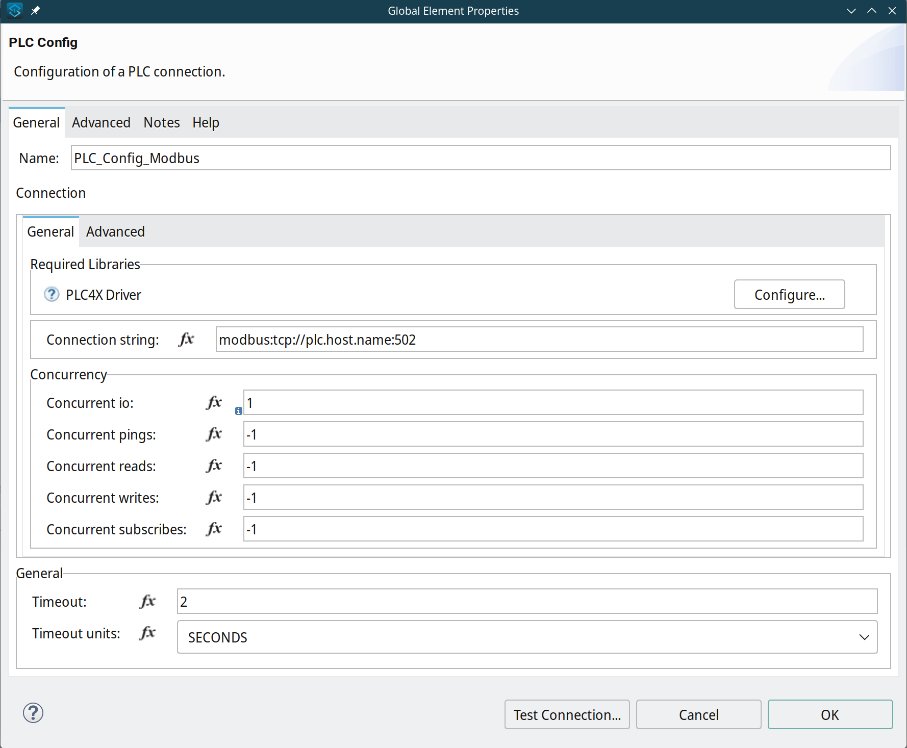
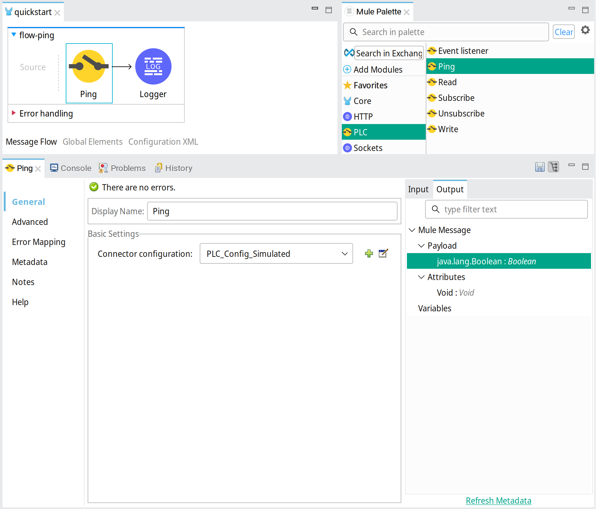
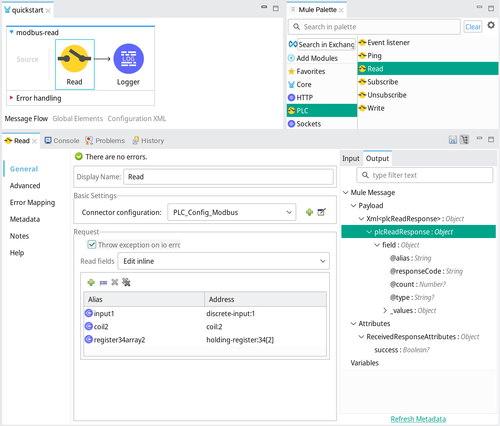

# Mule PLC Connector
--------------------

Mule PLC Connector enables Mule 4 applications to communicate with PLC systems.

PLC protocols that are supported by the [Apache PLC4X project](https://plc4x.apache.org/) can be used:
- AB-ETH
- ADS/AMS
- BACnet/IP
- CANopen
- DeltaV
- DF1
- EtherNet/IP
- Firmata
- KNXnet/IP
- Modbus
- OPC UA
- S7 (Step7)
- Simulated

## Dependencies
The Mule-PLC-connector uses Apache PLC4X version 0.9.0

## Mule supported versions
* Mule 4.1+

## Installation

To use the connector in a Mule 4 application, add following dependency to your application pom.xml:

```
<dependency>
    <groupId>nl.teslanet.mule.connectors.plc</groupId>
    <artifactId>mule-plc-connector</artifactId>
    <version>1.0.0-M4</version>
    <classifier>mule-plugin</classifier>
</dependency>
```

after adding the dependency to your application in AnypointStudio the connector is download from Maven Central. 
AnypointStudios Mule Palette will show the connectors operations ready for use. 

For every PLC protocol needed the corresponding PLC4X module has to be added to the pom as additional dependency of the Mule PLC connector. Find the corresponding Maven dependency on the [PLC4X site](https://plc4x.apache.org/users/protocols/) and add the dependency to the Mule Maven Plugin. 

For example the Modbus and Simulated module are added to the pom like this:
```
    <plugin>
         <groupId>org.mule.tools.maven</groupId>
         <artifactId>mule-maven-plugin</artifactId>
         <version>${mule.maven.plugin.version}</version>
         <extensions>true</extensions>
         <configuration>
             <additionalPluginDependencies>
                 <!-- The connector for which the dependency is defined -->
                 <plugin>
                     <groupId>nl.teslanet.mule.connectors.plc</groupId>
                     <artifactId>mule-plc-connector</artifactId>
                     <!-- Dependencies definition for the connector -->
                     <additionalDependencies>
                         <dependency>
                             <groupId>org.apache.plc4x</groupId>
                             <artifactId>plc4j-driver-modbus</artifactId>
                             <version>0.9.0</version>
                         </dependency>
                         <dependency>
                             <groupId>org.apache.plc4x</groupId>
                             <artifactId>plc4j-driver-simulated</artifactId>
                             <version>0.9.0</version>
                         </dependency>
                     </additionalDependencies>
                 </plugin>
             </additionalPluginDependencies>
         </configuration>
     </plugin>
```

## Usage

The connector's operations can be added to your Mule application by dragging from the AnypointStudios Mule Palette into the application flows, 
or by editing the application xml configuration directly.
Which operation is supported depends on the protocol used. Also the address-format of the accessible items on the PLC are protocol specific.
See [PLC4X documentation](https://plc4x.apache.org/users/protocols/).

### Config
The Config element configures how to connect to a PLC instance and is referenced by every operation that accesses it.

This example configures a Modbus PLC:



Xml configuration:
```
    <plc:config name="PLC_Config_Modbus">
        <plc:connection
            connectionUri="modbus:tcp://127.0.0.1:502" />
    </plc:config>
```

### Ping operation

The ping operation tests access to the PLC. When it is accessible the boolean value True is returned, otherwise False.

Example:



Xml configuration:
```
    <plc:ping doc:name="Ping" config-ref="PLC_Config" />
```

### Read operation

The read operation reads input from the PLC. Multiple items can be read at once. The alias is for correlation the response items to the request.

Example:



Xml configuration:
```
    <plc:read doc:name="Read" config-ref="PLC_Config_Modbus">
        <plc:read-fields>
            <plc:read-field alias="input1" address="discrete-input:1" />
            <plc:read-field alias="coil2" address="coil:2" />
            <plc:read-field alias="register34array2" address="holding-register:34[2]" />
        </plc:read-fields>
    </plc:read>
```

The result of the operation is a XML plcReadResponse message describing the values read. It contains an entry for every item indicating whether the read action was successful and if so, the value or values read.
The response for the request above could show:
```
    <plcReadResponse>
        <field alias="input1" count="1" responseCode="OK" type="BOOL">
            <value>true</value>
        </field>
        <field alias="coil2" count="1" responseCode="OK" type="BOOL">
            <value>false</value>
        </field>
        <field alias="register34array2" count="2" responseCode="OK" type="INT">
            <values>
                <value>31</value>
                <value>45</value>
            </values>
        </field>
    </plcReadResponse>

```

### Write operation

The write operation writes values to the PLC. Like the read operation, multiple items can be written at once. 
The alias for the field to write, the address and an array of values is given. When only one value is written an array of just one value is used.

Example: 


Xml configuration:
```
    <plc:write doc:name="Write" config-ref="PLC_Config_Modbus">
        <plc:write-fields>
            <plc:write-field alias="coil1" address="coil:1"
                values="#[ [ true ] ]" />
            <plc:write-field alias="register34array2" address="holding-register:34[2]"
                values="#[ [ 11, 22 ] ]" />
        </plc:write-fields>
    </plc:write>
```

The result of the write operation is a XML plcWriteResponse message describing which values are successfully written. The written values are returned in the response also, for information.
The response for the request above could show:

```
    <plcWriteResponse>
        <field alias="coil1" count="1" responseCode="OK" type="BOOL">
            <value>true</value>
        </field>
        <field alias="register34array2" count="2" responseCode="OK"
            type="INT">
            <values>
                <value>11</value>
                <value>22</value>
            </values>
        </field>
    </plcWriteResponse>

```
