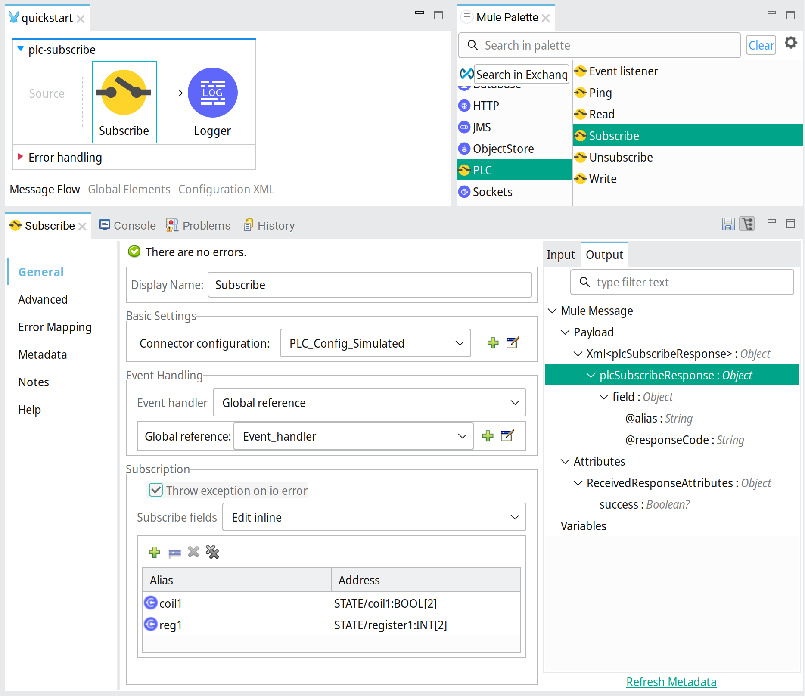
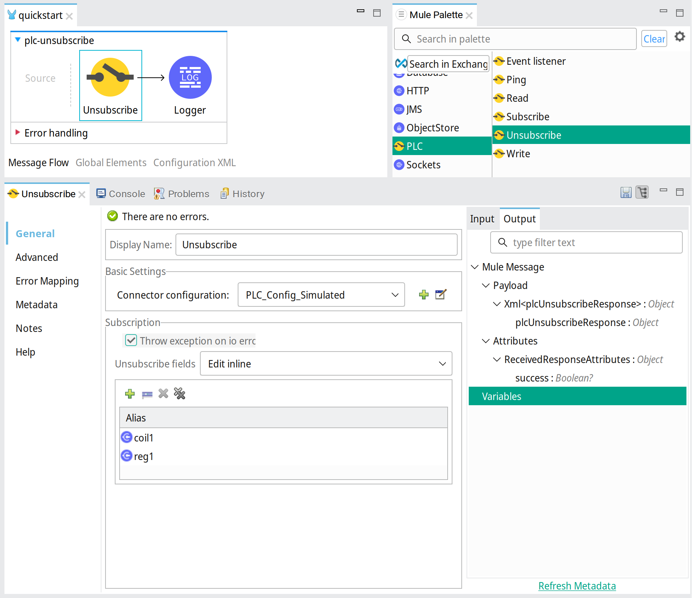

# Mule PLC Connector


## Introduction

Mule PLC Connector is a Mule extension that enables Mule 4 applications to communicate with PLC devices.

Several PLC protocols that are supported by the [Apache PLC4X project](https://plc4x.apache.org/) can be used:

- AB-ETH
- ADS/AMS
- BACnet/IP
- CANopen
- DeltaV
- DF1
- EtherNet/IP
- Firmata
- KNXnet/IP
- Modbus
- OPC UA
- S7 (Step7)
- Simulated

### Dependencies
The Mule PLC Connector uses [Apache PLC4X](https://plc4x.apache.org/) version 0.10.0

### Supported Mule versions
* Mule 4.1+

## Installation

The connector is installed by adding its Maven dependency to your Mule 4 application. Add following dependency to the pom:

```
<dependency>
    <groupId>nl.teslanet.mule.connectors.plc</groupId>
    <artifactId>mule-plc-connector</artifactId>
    <version>1.0.0</version>
    <classifier>mule-plugin</classifier>
</dependency>
```

When the dependency is added to your application in [AnypointStudio 7](https://en.wikipedia.org/wiki/MuleSoft), the connector will be installed from [Maven Central](). After that the Mule Palette in AnypointStudio will show the connectors operations, ready for use. 

For every PLC protocol needed in your application, the corresponding PLC4X Driver has to be added as dependency.
For example, to use Modbus and Simulated protocol add the dependencies to the pom like this:
 
```
		<dependency>
			<groupId>org.apache.plc4x</groupId>
			<artifactId>plc4j-driver-simulated</artifactId>
			<version>0.10.0</version>
		</dependency>
		<dependency>
			<groupId>org.apache.plc4x</groupId>
			<artifactId>plc4j-driver-modbus</artifactId>
			<version>0.10.0</version>
		</dependency>

```

See [PLC4X site](https://plc4x.apache.org/users/protocols/) for the the available drivers and their Maven coordinates.


Needed PLC4X Drivers have to be added as shared library to the configuration of the Mule Maven Plugin. This way the drivers become 
available on the classpath of the Mule PLC Connector. 

For example, to use Modbus and Simulated protocol, add the shared library configuration to the pom like this:

```
	<plugin>
		<groupId>org.mule.tools.maven</groupId>
		<artifactId>mule-maven-plugin</artifactId>
		<version>${mule.maven.plugin.version}</version>
		<extensions>true</extensions>
		<configuration>
			<sharedLibraries>
				<sharedLibrary>
					<groupId>org.apache.plc4x</groupId>
					<artifactId>plc4j-driver-simulated</artifactId>
				</sharedLibrary>
				<sharedLibrary>
					<groupId>org.apache.plc4x</groupId>
					<artifactId>plc4j-driver-modbus</artifactId>
				</sharedLibrary>
			</sharedLibraries>
		</configuration>
	</plugin>
```

## Usage

The PLC operations such as _Read_ and _Write_, can be added to your application by dragging from the AnypointStudios Mule Palette into the application flows, 
or by editing the application xml configuration directly.

Which operation is supported depends on the protocol used. Also the address-format of PLC fields are protocol specific.
See [PLC4X documentation](https://plc4x.apache.org/users/protocols/).

### Configuration

The Config element configures how to connect to a PLC instance. The configuration is referenced by every operation that accesses the PLC. 
Different parameters can be set to accommodate the PLC device capabilities.
The concurrency parameters set limitations on the number of operations that will be executed simultaneously. 
The _concurrentIo_ parameter limits total concurrency of all operation types, which has a default of 1. 
As a result all operations are serialized by default. Set an appropriate value if concurrency is needed, where a negative value means unlimited concurrency.
The timeout value will be used as maximum operation duration.  

For example the configuration of a Modbus PLC:


Xml configuration:

```
    <plc:config name="PLC_Config_Modbus" 
    	timeout="2" timeoutUnits="SECONDS">
        <plc:connection
            connectionString="modbus:tcp://plc.host.name:502" 
            concurrentIo="1"/>
    </plc:config>
```

### Ping operation

The ping operation tests accessibility of the PLC. When accessible a boolean value True is returned, otherwise False.

Ping example:


Xml configuration:

```
    <plc:ping doc:name="Ping" config-ref="PLC_Config_Simulated" />
```

### Read operation

The read operation reads actual field values from the PLC. Multiple fields can be read in one request. Every field has an alias to correlate the field in the response. 

Read example:


Xml configuration:

```
    <plc:read doc:name="Read" config-ref="PLC_Config_Modbus">
        <plc:read-fields>
            <plc:read-field alias="input1" address="discrete-input:1" />
            <plc:read-field alias="coil2" address="coil:2" />
            <plc:read-field alias="register34array2" address="holding-register:34[2]" />
        </plc:read-fields>
    </plc:read>
```

The result of the read operation is a **plcReadResponse** message describing the values that are read. It contains an entry for every field. Each entry gives the responseCode, alias and the values that are read.
The response on the request above could be:

```
    <plcReadResponse>
        <field alias="input1" count="1" responseCode="OK" type="BOOL">
            <value>true</value>
        </field>
        <field alias="coil2" count="1" responseCode="OK" type="BOOL">
            <value>false</value>
        </field>
        <field alias="register34array2" count="2" responseCode="OK" type="INT">
            <values>
                <value>31</value>
                <value>45</value>
            </values>
        </field>
    </plcReadResponse>

```

### Write operation

The write operation writes values to one or more fields of the PLC. The request contains for every field, the alias, the address and an array of one or more values to write.

Write example: 


Xml configuration:

```
    <plc:write doc:name="Write" config-ref="PLC_Config_Modbus">
        <plc:write-fields>
            <plc:write-field alias="coil1" address="coil:1"
                values="#[ [ true ] ]" />
            <plc:write-field alias="register34array2" address="holding-register:34[2]"
                values="#[ [ 11, 22 ] ]" />
        </plc:write-fields>
    </plc:write>
```

The result of the write operation is a **plcWriteResponse** message describing which values are successfully written. The written values are returned in the response for information. 

The response on the request above could be:

```
    <plcWriteResponse>
        <field alias="coil1" count="1" responseCode="OK" type="BOOL">
            <value>true</value>
        </field>
        <field alias="register34array2" count="2" responseCode="OK"
            type="INT">
            <values>
                <value>11</value>
                <value>22</value>
            </values>
        </field>
    </plcWriteResponse>

```

### Subscribe operation

The subscribe operation subscribes to one or more fields of the PLC. The request contains for every field to subscribe, the alias and the address.
After executing the operation every change on subscribed field values triggers an event that is delivered to the given event handler. 

Subscribe example using the Simulated protocol: 



Xml configuration:

```
    <plc:subscribe config-ref="PLC_Config_Simulated" eventHandler="Event_handler">
        <plc:subscribe-fields >
            <plc:subscribe-field alias="coil1" address="STATE/coil1:BOOL[2]" />
            <plc:subscribe-field alias="reg1" address="STATE/register1:INT[2]" />
        </plc:subscribe-fields>
    </plc:subscribe>
```

The result of the subscribe operation is a **plcSubscribeResponse** message describing which fields are successfully subscribed to.

The response on the request above could be:

```
    <plcSubscribeResponse>
        <field alias="coil1" responseCode="OK"/>
        <field alias="reg1" responseCode="OK"/>
    </plcSubscribeResponse>

```

### Unsubscribe operation

The unsubscribe operation cancels a subscription. The request contains the subscription name and the name of the handler owning the subscription.
After execution of this operation no events for concerning subscription are delivered to the event handler any more. 

Unsubscribe example using the Simulated protocol: 



Xml configuration:

```
    <plc:unsubscribe config-ref="PLC_Config_Simulated">
        <plc:unsubscribe-fields >
            <plc:unsubscribe-field alias="coil1" />
            <plc:unsubscribe-field alias="reg1" />
        </plc:unsubscribe-fields>
    </plc:unsubscribe>
```

The result of the unsubscribe operation is a **plcUnsubscribeResponse** message describing which subscription has been cancelled.

The response on the request above could be:

```
    <plcUnsubscribeResponse/>

```

### Event listener

The event handler collects events that occur on subscribed fields. The event listener delivers the event message containing actual value(s) to the flow for processing.

Event listener example: 


Xml configuration:

```
    <plc:event-listener doc:name="Event listener" eventHandler="Event_handler"/>
```

The events are delivered using a **plcEvent** message containing actual value(s) of the field. The field alias in the event messages matches the alias given in the subscription.

An event message from the subscription above could be:

```
<plcEvent>
  <field alias="coil1" responseCode="OK">
    <values>
      <value>true</value>
      <value>false</value>
    </values>
  </field>
</plcEvent>

```

    
    
