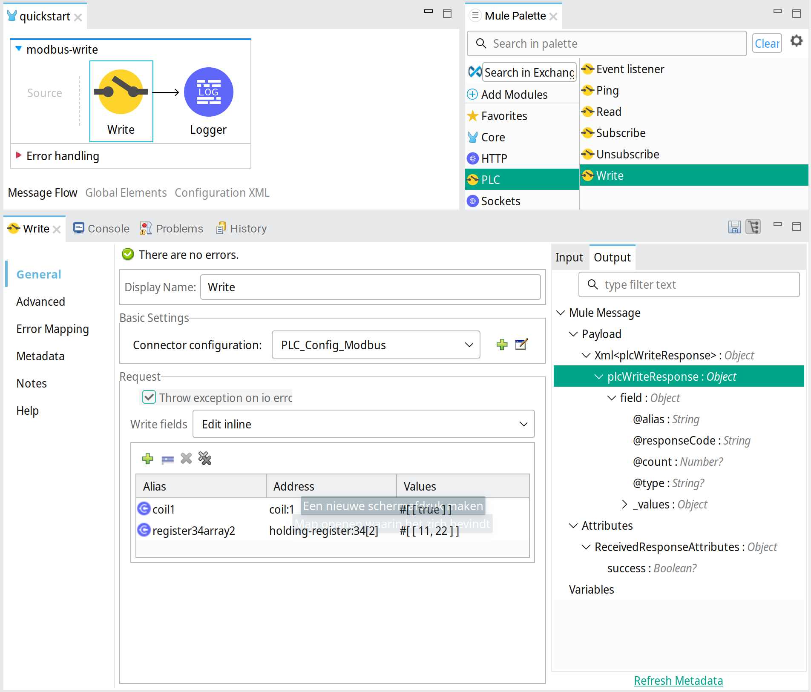

# Mule PLC Connector
--------------------

## Introduction

Mule PLC Connector is a Mule extension that enables Mule 4 applications to communicate with PLC devices.

Several PLC protocols that are supported by the [Apache PLC4X project](https://plc4x.apache.org/) can be used:

- AB-ETH
- ADS/AMS
- BACnet/IP
- CANopen
- DeltaV
- DF1
- EtherNet/IP
- Firmata
- KNXnet/IP
- Modbus
- OPC UA
- S7 (Step7)
- Simulated

### Dependencies
The Mule PLC Connector uses [Apache PLC4X](https://plc4x.apache.org/) version 0.9.0

### Supported Mule versions
* Mule 4.1+

## Installation

The connector is installed by adding its Maven dependency to your Mule 4 application. Add following dependency to the pom:

```
<dependency>
    <groupId>nl.teslanet.mule.connectors.plc</groupId>
    <artifactId>mule-plc-connector</artifactId>
    <version>1.0.0-M4</version>
    <classifier>mule-plugin</classifier>
</dependency>
```

When this dependency is added to your application in [AnypointStudio 7](https://en.wikipedia.org/wiki/MuleSoft), the connector will be installed from Maven Central. After that the Mule Palette in AnypointStudio will show the connectors operations, ready for use. 

For every PLC protocol needed in your application, the corresponding PLC4X module has to be added to the pom as well, as additional dependency of the Mule PLC connector. Find the PLC4X module dependency on the [PLC4X site](https://plc4x.apache.org/users/protocols/) and add this to the configuration of the Mule Maven Plugin. 

For example, to use Modbus and Simulated protocol add the dependencies to the pom like this:

```
    <plugin>
         <groupId>org.mule.tools.maven</groupId>
         <artifactId>mule-maven-plugin</artifactId>
         <version>${mule.maven.plugin.version}</version>
         <extensions>true</extensions>
         <configuration>
             <additionalPluginDependencies>
                 <!-- The connector for which the dependency is defined -->
                 <plugin>
                     <groupId>nl.teslanet.mule.connectors.plc</groupId>
                     <artifactId>mule-plc-connector</artifactId>
                     <!-- Dependencies definition for the connector -->
                     <additionalDependencies>
                         <dependency>
                             <groupId>org.apache.plc4x</groupId>
                             <artifactId>plc4j-driver-modbus</artifactId>
                             <version>0.9.0</version>
                         </dependency>
                         <dependency>
                             <groupId>org.apache.plc4x</groupId>
                             <artifactId>plc4j-driver-simulated</artifactId>
                             <version>0.9.0</version>
                         </dependency>
                     </additionalDependencies>
                 </plugin>
             </additionalPluginDependencies>
         </configuration>
     </plugin>
```

## Usage

The PLC operations such as _Read_ and _Write_, can be added to your application by dragging from the AnypointStudios Mule Palette into the application flows, 
or by editing the application xml configuration directly.

Which operation is supported depends on the protocol used. Also the address-format of PLC fields are protocol specific.
See [PLC4X documentation](https://plc4x.apache.org/users/protocols/).

### Configuration

The Config element configures how to connect to a PLC instance. The configuration is referenced by every operation that accesses the PLC.

For example the configuration of a Modbus PLC:


Xml configuration:

```
    <plc:config name="PLC_Config_Modbus">
        <plc:connection
            connectionUri="modbus:tcp://plc.host.name:502" />
    </plc:config>
```

### Ping operation

The ping operation tests accessibility of the PLC. When accessible a boolean value True is returned, otherwise False.

Ping example:


Xml configuration:

```
    <plc:ping doc:name="Ping" config-ref="PLC_Config" />
```

### Read operation

The read operation reads actual field values from the PLC. Multiple fields can be read in one request. Every field has an alias to correlate the field in the response. 

Read example:


Xml configuration:

```
    <plc:read doc:name="Read" config-ref="PLC_Config_Modbus">
        <plc:read-fields>
            <plc:read-field alias="input1" address="discrete-input:1" />
            <plc:read-field alias="coil2" address="coil:2" />
            <plc:read-field alias="register34array2" address="holding-register:34[2]" />
        </plc:read-fields>
    </plc:read>
```

The result of the read operation is a **plcReadResponse** message describing the values that are read. It contains an entry for every field. Each entry gives the responseCode, alias and the values that are read.
The response on the request above could be:

```
    <plcReadResponse>
        <field alias="input1" count="1" responseCode="OK" type="BOOL">
            <value>true</value>
        </field>
        <field alias="coil2" count="1" responseCode="OK" type="BOOL">
            <value>false</value>
        </field>
        <field alias="register34array2" count="2" responseCode="OK" type="INT">
            <values>
                <value>31</value>
                <value>45</value>
            </values>
        </field>
    </plcReadResponse>

```

### Write operation

The write operation writes values to one or more fields of the PLC. The request contains for every field, the alias, the address and an array of one or more values to write.

Write example: 



Xml configuration:

```
    <plc:write doc:name="Write" config-ref="PLC_Config_Modbus">
        <plc:write-fields>
            <plc:write-field alias="coil1" address="coil:1"
                values="#[ [ true ] ]" />
            <plc:write-field alias="register34array2" address="holding-register:34[2]"
                values="#[ [ 11, 22 ] ]" />
        </plc:write-fields>
    </plc:write>
```

The result of the write operation is a **plcWriteResponse** message describing which values are successfully written. The written values are returned in the response for information. 

The response on the request above could be:

```
    <plcWriteResponse>
        <field alias="coil1" count="1" responseCode="OK" type="BOOL">
            <value>true</value>
        </field>
        <field alias="register34array2" count="2" responseCode="OK"
            type="INT">
            <values>
                <value>11</value>
                <value>22</value>
            </values>
        </field>
    </plcWriteResponse>

```

